# Report

See [README.md](./README.md) for details on how to run the application.

## Task 1: Important Isosurfaces

Select the isovalues corresponding to the skin (631), muscle (996), and bone
(1526) of the model.

### Head

#### Isosurface: 631

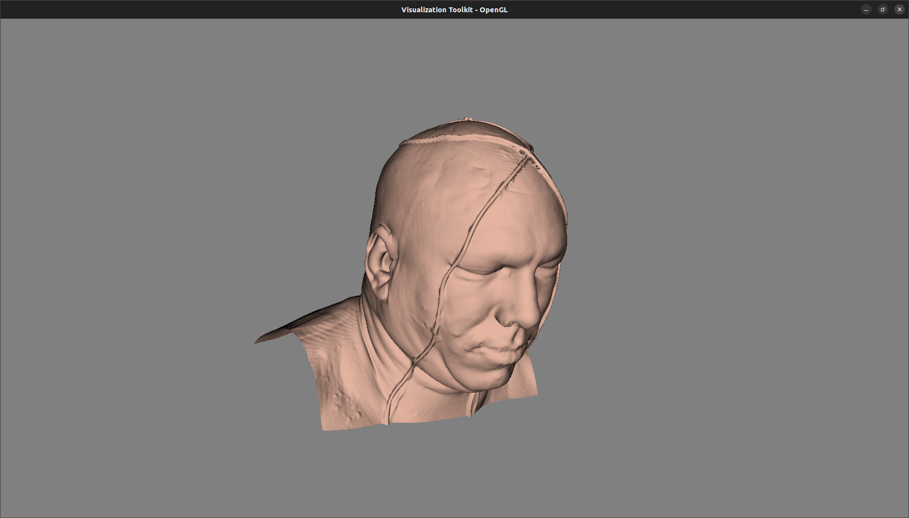

#### Isosurface: 996

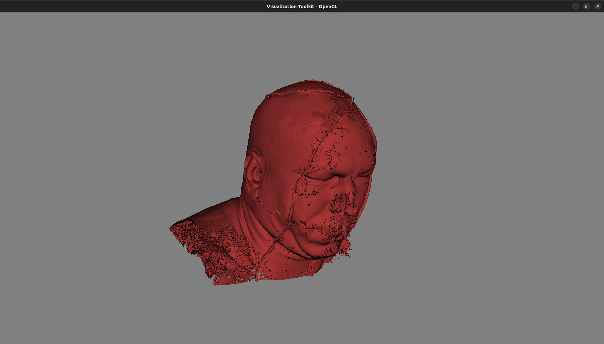

#### Isosurface: 1526

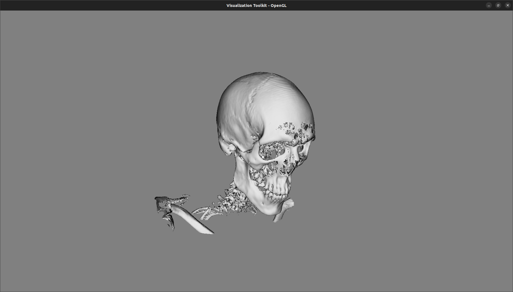

#### Combined

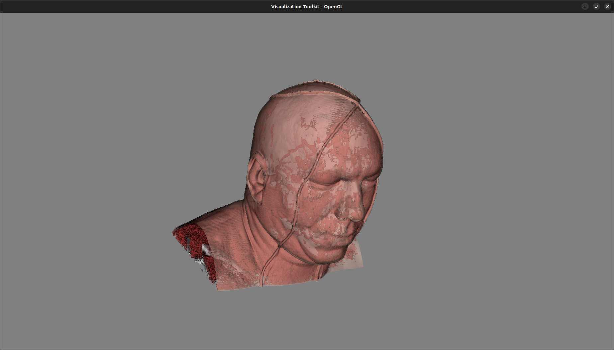

### Flame

Select the isovalues corresponding to:

- environment (6501)
- lowest value of the visible flame (33698)
- mean value of the visible flame (41235)
- highest value of the visible flame (65000)

#### Isosurface: 6501

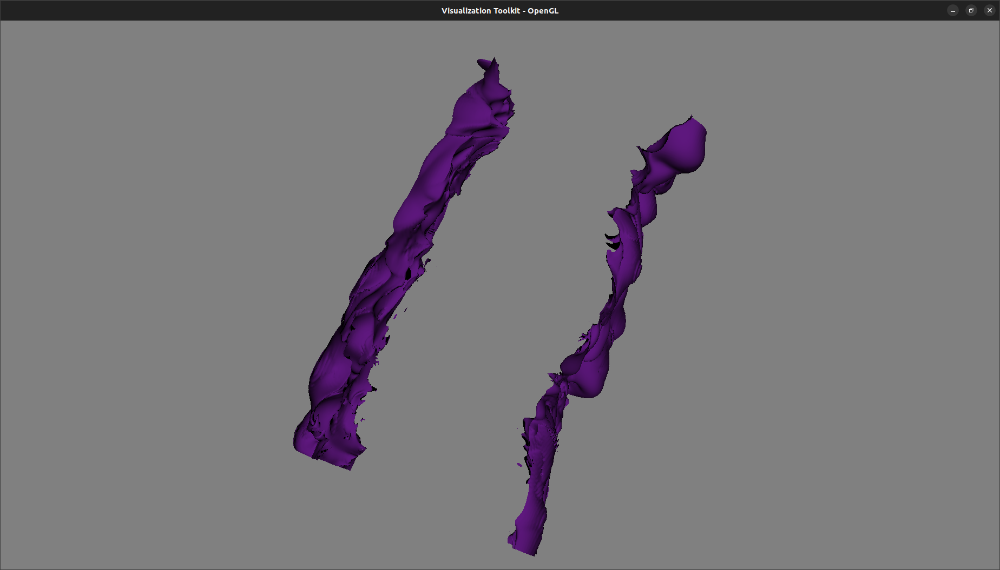

#### Isosurface: 33698

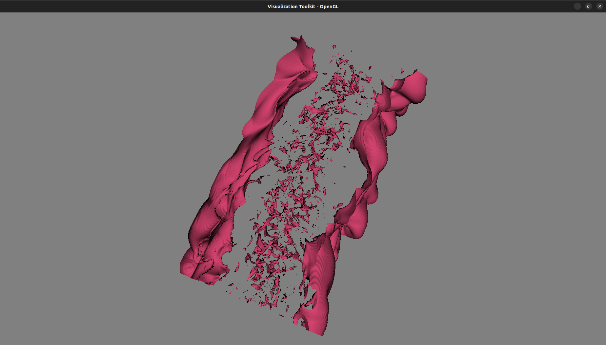

#### Isosurface: 41235

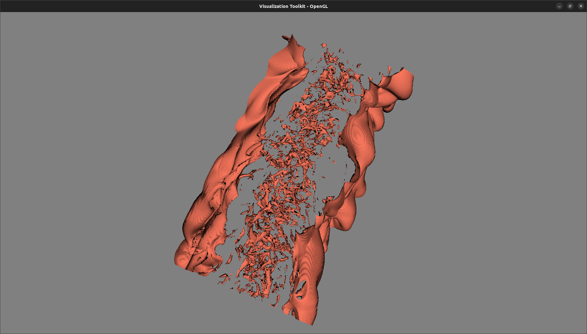

#### Isosurface: 65000

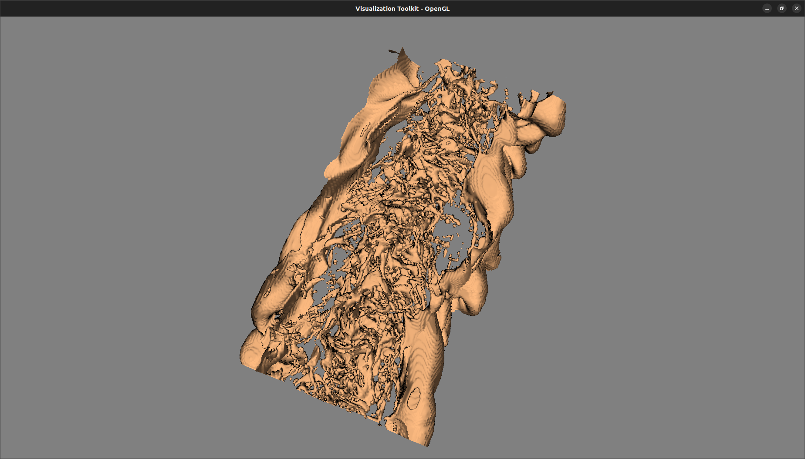

#### Combined

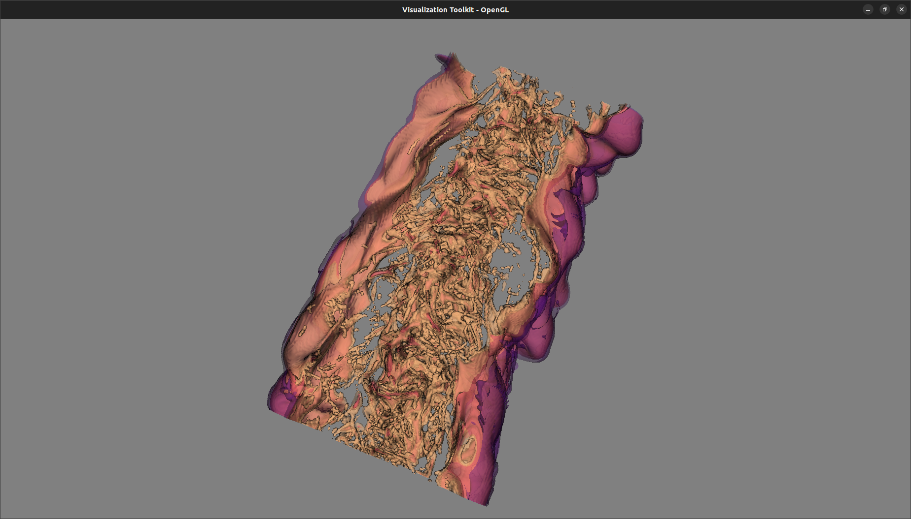

## Task 2: Transfer Function Design

### Head

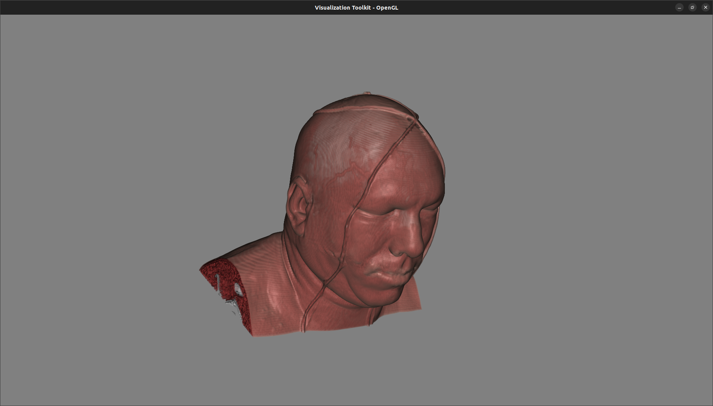

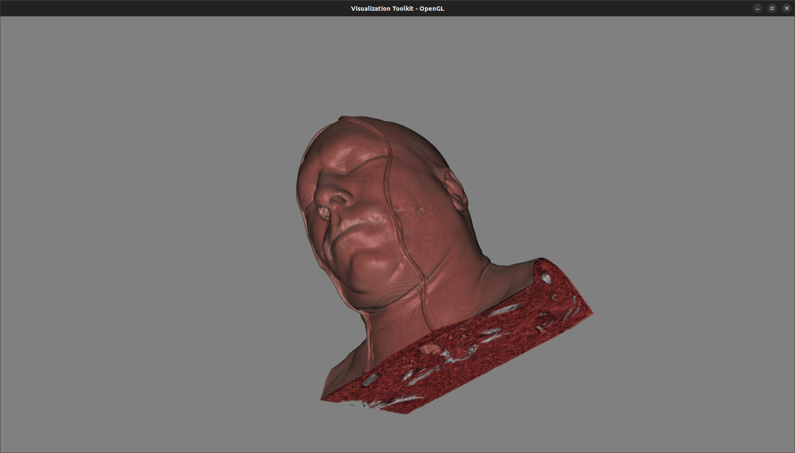

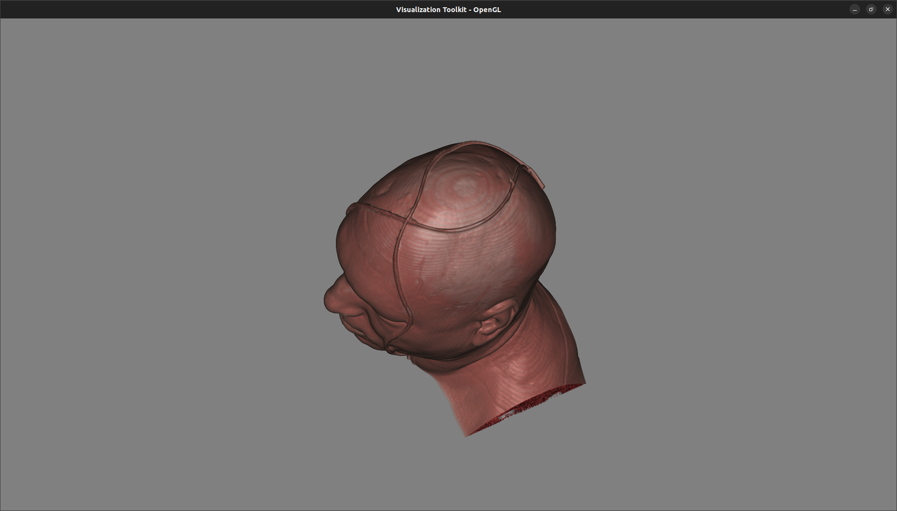

#### Transfer Function

- Use the previous isovalues to define the value of "peaks".
- Set the opacity of the bone slightly higher than the skin and muscle for
  better visibility.
- Set the width of each peaks to 150 to render the fuzzy edges of each isovalue.

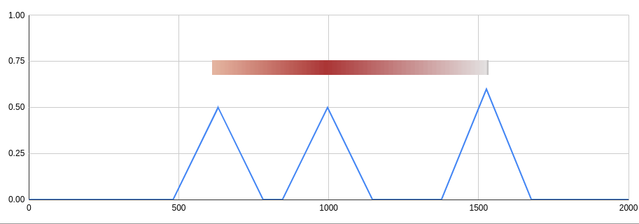

### Flame

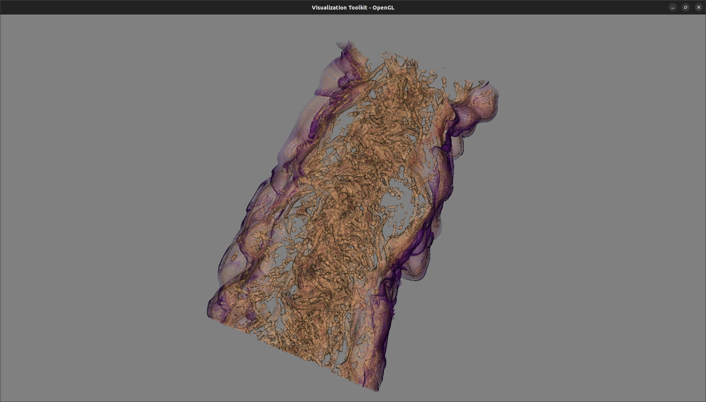

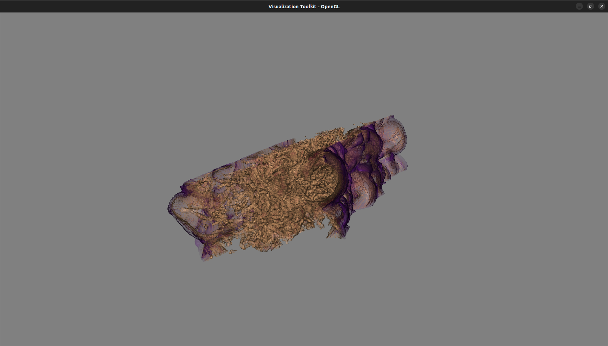

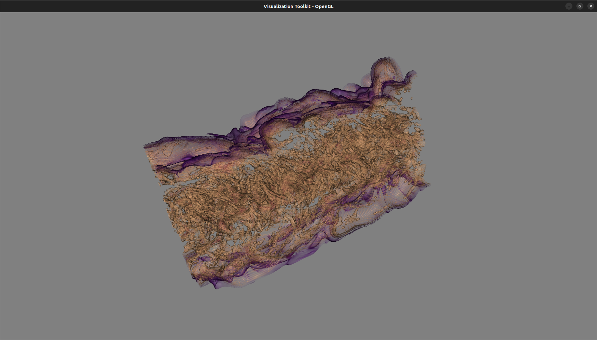

#### Transfer Function

- Use the previous isovalues to define the value of "peaks".
- Set the opacity of the highest value of the visible flame slightly higher than
  other peaks for better visibility.
- Set the width of each peaks to 500 to render the fuzzy edges of each isovalue.

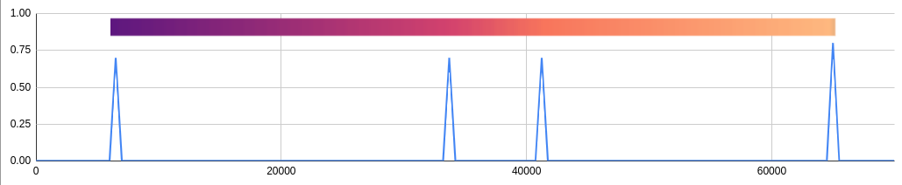

#### Strengths and Limitations

The transfer function with multiple peaks is suitable for rendering the model
with different "layers", such as the head model with three tissues. However, it
could not perfectly visualize the flame model, which does not have a clear
boundary between different parts of the model. Widening the peaks and increasing
the number of peaks could be helpful to improve the visualization of the flame
model.

Also, our method choosing the width of the peaks uniformly could be improved.
For instance, the width of the peaks for the muscle tissue in the head model
could be wider than the width of others.

## Task 3: Volume Rendering vs. Isosurfacing

### Head

| Isosurfacing                                                 | Volume Rendering                                          |
| ------------------------------------------------------------ | --------------------------------------------------------- |
|  |  |

### Flame

| Isosurfacing                                                   | Volume Rendering                                            |
| -------------------------------------------------------------- | ----------------------------------------------------------- |
|  |  |
