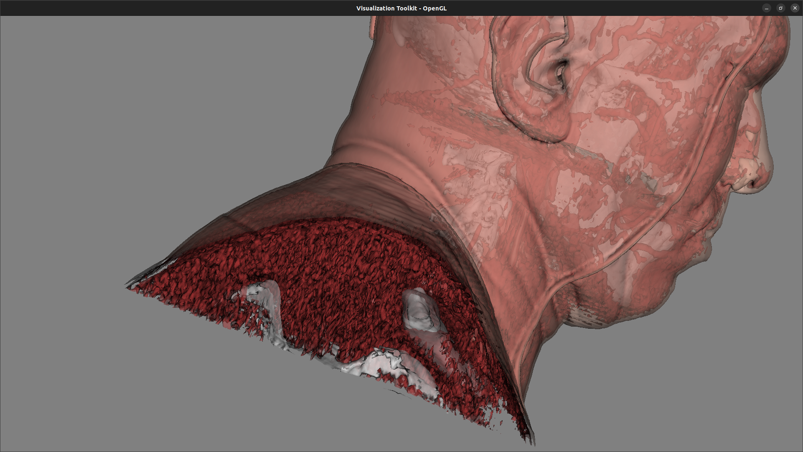
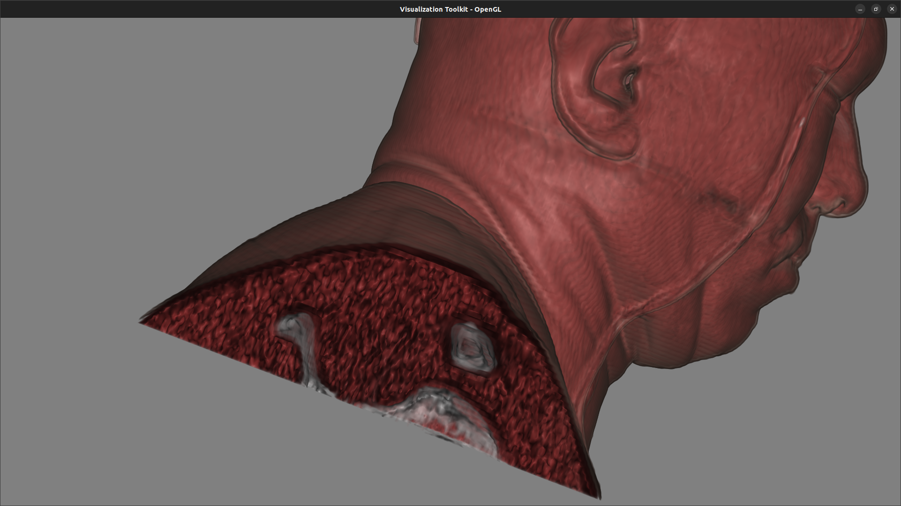
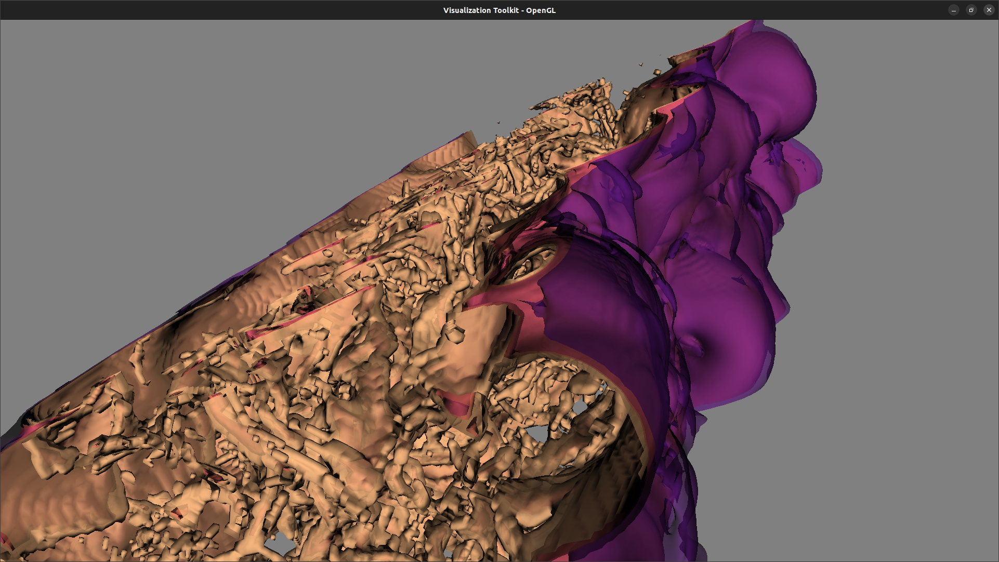
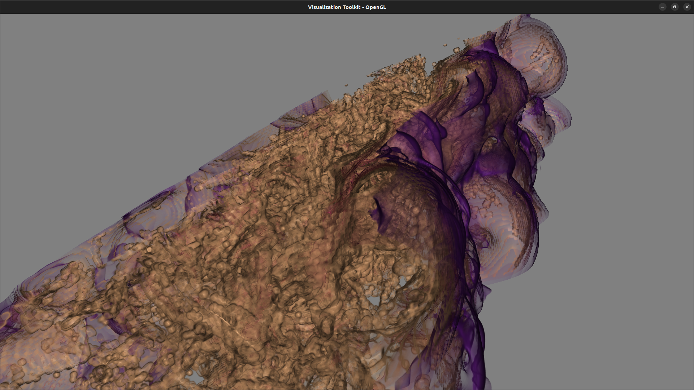

# Report

See [README.md](./README.md) for details on how to run the application.

## Task 1: Important Isosurfaces

Select the isovalues corresponding to the skin (631), muscle (996), and bone
(1526) of the model.

### Head

#### Isosurface: 631

#### Isosurface: 996

#### Isosurface: 1526

#### Combined

### Flame

Select the isovalues corresponding to:

- environment (6501)
- lowest value of the visible flame (33698)
- mean value of the visible flame (41235)
- highest value of the visible flame (65000)

#### Isosurface: 6501

#### Isosurface: 33698

#### Isosurface: 41235

#### Isosurface: 65000

#### Combined

## Task 2: Transfer Function Design

### Head

#### Transfer Function

- Use the previous isovalues to define the value of "peaks".
- Set the opacity of the bone slightly higher than the skin and muscle for
  better visibility.
- Set the width of each peaks to 150 to render the fuzzy edges of each isovalue.

### Flame

#### Transfer Function

- Use the previous isovalues to define the value of "peaks".
- Set the opacity of the highest value of the visible flame slightly higher than
  other peaks for better visibility.
- Set the width of each peaks to 500 to render the fuzzy edges of each isovalue.

#### Strengths and Limitations

The transfer function with multiple peaks is suitable for rendering the model
with different "layers", such as the head model with three tissues. However, it
could not perfectly visualize the flame model, which does not have a clear
boundary between different parts of the model. Widening the peaks and increasing
the number of peaks could be helpful to improve the visualization of the flame
model.

Also, our method choosing the width of the peaks uniformly could be improved.
For instance, the width of the peaks for the muscle tissue in the head model
could be wider than the width of others.

## Task 3: Volume Rendering vs. Isosurfacing

### Head

| Isosurfacing                                                 | Volume Rendering                                          |
| ------------------------------------------------------------ | --------------------------------------------------------- |
|  |  |

### Flame

#### Fuzziness

| Isosurfacing                                                   | Volume Rendering                                            |
| -------------------------------------------------------------- | ----------------------------------------------------------- |
|  |  |

The volume rendering method could express the fuzziness by specifying the
opacity with the piecewise function. On the other hand, the isosurfacing method
shows the layer of the model with a sharp boundary.

#### Muscle Texture

| Isosurfacing                                                            | Volume Rendering                                                              |
| ----------------------------------------------------------------------- | ----------------------------------------------------------------------------- |
|  |  |

The volume rendering method could express the texture of the muscle tissue. It
shows the partial muscle tissue is overlapped with the bone tissue in a more
realistic way in comparison with the isosurfacing method.

#### Shape of the Flame

| Isosurfacing                                                           | Volume Rendering                                                               |
| ---------------------------------------------------------------------- | ------------------------------------------------------------------------------ |
|  |  |

The volume rendering method presents the shape and the fuzziness of the flame
more realistically than the isosurfacing method. Intuitively, there is no sharp
boundary between the visible flame and the environment, and thus it would be
less accurate to render the model with isosurfacing.

#### Conclusion

For both datasets, I found the volume rendering method is more suitable as it
has more flexibility to express the fuzziness and the texture of the model.

## Summary Analysis

The advantages of the volume rendering method are:

- It could express the fuzziness of the model.
- It could express the fluid-like texture of the model.
- It could express the shape of the model more realistically, such as the flame
  model in Task 2.

The advantages of the isosurfacing method are:

- It could express the layer of the model with a sharp boundary, which could be
  more easily understood by the users.
- It has better performance than the volume rendering method.
- It could be more suitable for rendering the model with a clear boundary
  between different parts of the model, such as the head model in Task 1.
